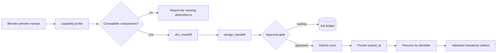

# Codex Dreamina 3D Plugin


> Orchestrate a validated Blender preview into a verified Dreamina Seedance render — submit once, resume by identifier.

[](https://github.com/partme-ai/codex-dreamina-3d-plugin)
[](LICENSE)

[English](README.md) | [简体中文](README.zh-CN.md) · [Install](#installation) · [Quick start](#quick-start) · [Handoff contract](#handoff-contract) · [Troubleshooting](#troubleshooting)

## Positioning

`codex-dreamina-3d` is a receipt-driven composition plugin, not a DCC implementation. It takes a Blender preview that already passed its own validation, hands the recipe to Dreamina Design, waits at the approval gate, submits once, and then recovers the result by its stored `submit_id`.

It owns no modelling, no uploader, and no billing logic. Every neighbouring responsibility stays with the plugin that already implements it.

### Who it is for

- 3D artists who already use the Blender plugin and want the validated preview turned into a rendered 3D result.
- Pipeline engineers who need a deterministic handoff with a durable ledger and no duplicate spending.
- Reviewers who need to see which preview produced which submission, and where it stopped.

### What problem it solves

| Problem | What this plugin provides | Verifiable entry point |
|---|---|---|
| Handoffs lose track of state | A durable operation ledger keyed by `submit_id` | `scripts/job_ledger.py` |
| A retry causes double spending | A duplicate submit returns the stored identifier instead of charging again | `scripts/design_handoff.py` |
| Companion plugins drift | Capability probing discovers the installed companion versions | `scripts/capability_probe.py` |
| Receipts are unverifiable | A receipt-driven handoff validator | `scripts/handoff_validator.py` |

## At a glance

```text
Blender scene (already validated by codex-blender)
      │
      ▼
┌──────────────────────────────────────────────────────────┐
│ codex-dreamina-3d                                        │
│  ① probe      discover compatible companion plugins      │
│  ② validate   check the DCC preview receipt              │
│  ③ hand off   pass the recipe to Dreamina Design         │
│  ④ wait       stop at the real user approval gate        │
│  ⑤ submit     submit once, persist the submit_id         │
│  ⑥ resume     query by identifier until it converges     │
└──────────────────────────────────────────────────────────┘
      │
      ▼
Verified Seedance render artifact + operation receipt
```

| Property | Value |
|---|---|
| Plugin ID | `codex-dreamina-3d` |
| Host | Codex CLI or ChatGPT desktop app |
| Current version | `0.3.0` |
| Plugin manifest | `.codex-plugin/plugin.json` |
| MCP configuration | none — the plugin orchestrates companion plugins over argv and JSON |
| Primary language | Python 3.13 |
| License | Apache-2.0 |

## Capabilities and boundaries

### Supported

| Capability | Input | Output | Limit | Status |
|---|---|---|---|---|
| Companion discovery | An installed plugin set | Compatible Blender or Maya adapter plus Dreamina Design | Read-only probe | Stable |
| Preview validation | A DCC preview receipt | Accepted or rejected receipt | A rejected receipt stops the flow | Stable |
| Three-entry routing | Blender, Jimeng Web, or automatic Seedance route | A chosen route with a stated reason | One route per request | Stable |
| Submission | An approved recipe | One submission with a persisted `submit_id` | Never submits twice for the same recipe | Stable |
| Resumable orchestration | An existing operation | Progress until completion or a real user gate | Stops at gates instead of forcing them | Stable |
| Receipt validation | A returned artifact | Validated receipt | — | Stable |

### Not responsible for

- Duplicating Blender, media, authentication, billing, or Dreamina CLI logic.
- Installing companion plugins or DCC applications silently.
- Shipping the vendor uploader source, a bundled ffmpeg, a local browser bridge, or a private API replica.
- Treating local preview completion and remote generation completion as one gate. They are separate.
- Autodesk Maya as a production runtime. Maya remains an experimental fixture-compatible path whose runtime status is `NOT_RUN`.

### Maturity

| Status | Meaning |
|---|---|
| Stable | Automated tests plus recorded evidence; usable for real work |
| Experimental | Contract evolution only; not advertised as a production runtime |
| Blocked / NOT_RUN | Not verified; never present it as available |

## Architecture and core flow



### Component responsibilities

| Component | Owns | Does not own |
|---|---|---|
| `scripts/capability_probe.py` | Discovering compatible companion installations | Installing them |
| `scripts/dcc_handoff.py` | The argv and JSON boundary with the DCC adapter | DCC internals |
| `scripts/design_handoff.py` | The boundary with Dreamina Design and idempotent submission | Approval decisions |
| `scripts/auto_orchestrator.py` | Advancing one job until completion or a real gate | Forcing an external gate open |
| `scripts/job_ledger.py` | Atomic persistence of operation receipts | Secret storage |
| `scripts/handoff_validator.py` | Receipt validation | Artifact generation |
| `skills/` (6) | Routing and recovery instructions for Codex | Runtime enforcement |

## Compatibility

| Plugin version | Host | Companions | Runtime | Status |
|---|---|---|---|---|
| `0.3.0` | Codex CLI or ChatGPT desktop app | `codex-blender` and `codex-dreamina-design` at pinned revisions | macOS with Blender 5.2.1 LTS, Python 3.13 | Verified |
| `0.3.0` | Codex CLI or ChatGPT desktop app | Maya adapter fixture | Any | Experimental; runtime `NOT_RUN` |

The paid Dreamina 3D to Design MCP end-to-end path and the official Web runtime are recorded separately in `docs/verification/`; the Web path is recorded as `BLOCKED_MISSING_OFFICIAL_ADDON` until the official uploader is present.

## Installation

### Prerequisites

- Python 3.13.
- `codex-blender` installed and able to produce a validated preview receipt.
- `codex-dreamina-design` installed and able to submit, since it owns the approval and billing boundary.
- Blender 5.2.1 LTS for the preview side.

### From the plugin marketplace

```bash
codex plugin marketplace add partme-ai/codex-dreamina-3d-plugin --ref main
codex plugin add codex-dreamina-3d@partme-ai-dreamina-3d
```

Restart Codex or the ChatGPT desktop app, then open a new task so the Skills load.

### Development extras

```bash
python3 -m pip install -r requirements-dev.txt
```

This installs `jsonschema` and `PyYAML`, which the gates need.

### Confirm it loaded

```bash
codex plugin list
```

Expected entry:

```text
codex-dreamina-3d@partme-ai-dreamina-3d  installed, enabled
```

Then confirm the companions are discoverable:

```bash
python3 scripts/capability_probe.py
```

## Quick start

### 1. Start from a validated preview

Finish the Blender side first. The preview receipt is the input contract; without it this plugin stops.

### 2. Ask Codex for the render

```text
Turn my validated Blender preview into a Dreamina 3D render. Show me the quote first.
```

Expected observation: the plugin probes for companions, validates the preview receipt, and stops at the approval gate with a quote rather than submitting.

### 3. Approve once, then resume

After you approve, the plugin submits once and stores the `submit_id`. If anything interrupts the wait, ask to resume:

```text
Resume my Dreamina 3D task without submitting it again.
```

Expected observation: the operation is queried by its stored identifier and no new paid action is taken.

## Configuration

There is no plugin configuration file. Routing inputs come from the preview receipt and the discovered companions.

| Setting | Where it lives | Notes |
|---|---|---|
| Companion revisions | The installed `codex-blender` and `codex-dreamina-design` plugins | Verified by the capability probe |
| Operation ledger | Written by `scripts/job_ledger.py` | Atomic writes with a monotonic revision; non-secret fields only |
| Approval | Owned by `codex-dreamina-design` | This plugin waits rather than deciding |

## Handoff contract

### Operation states

`Draft`, `DccSelected`, `PreviewSpecified`, `PreviewValidated`, `CapabilityResolved`, `Quoted`, `Approved`, `Submitted`, `Querying`, `Completed`, `Failed`, `Unknown`.

### Submission rules

- The `submit_id` returned by the design plugin is persisted before any success is reported.
- A duplicate submit returns the previously stored identifier and performs no new paid action.
- Receipts store only non-secret identifiers, hashes, states, and timestamps.
- Failure modes do not retry automatically; a timeout never authorizes resubmission.

## Retry, idempotency, and recovery

- One job advances until completion or a real external or user gate; the orchestrator does not force a gate open.
- Recovery is keyed on the stored `submit_id`; a new identifier is never minted to bypass an uncertain result.
- Ledger writes are atomic (write to a temporary file, fsync, replace) with a monotonic revision.
- Receipt validation runs before a result is reported as complete.

## Data and state

| Data | Location | Lifecycle | Secrets |
|---|---|---|---|
| Operation receipt | Written by `scripts/job_ledger.py` | Until you delete it | None; identifiers, hashes, states, timestamps |
| Preview receipt | Produced by `codex-blender` | Consumed at validation | None |
| Render artifact | Dreamina's own service | Owned by the service | Managed by the companion plugin |

## Security

- No credentials live in this repository; authentication belongs to the companion plugins.
- Only non-secret fields are persisted: identifiers, hashes, states, and timestamps.
- Companion boundaries are argv and JSON only; no shell string is constructed and no private API is replicated.
- The plugin never installs a dependency silently, and it reports a missing companion instead of working around it.
- The vendor uploader is not bundled; its runtime gate stays blocked until the user installs it.

## Development and verification

```bash
python3 scripts/ci_gate.py --strict
python3 -m unittest discover -s tests -v
python3 scripts/validate_distribution.py
python3 scripts/trace_gate.py
```

Development gates accept `--strict`. The CI gate is the authoritative entry point.

Recorded evidence:

- [End-to-end](docs/verification/end-to-end.md) and [production release](docs/verification/production-release-2026-09-14.md) records.
- [Blender path](docs/verification/blender-path.md), [Dreamina path](docs/verification/dreamina-path.md), and [Maya path](docs/verification/maya-path.md) — the Maya record states runtime `NOT_RUN`.
- [Offline verification](docs/verification/offline.md) and [TRACE](docs/verification/trace.md).
- [Codex plugin compliance](docs/verification/codex-plugin-compliance.md).

## Troubleshooting

| Symptom | Check first | Resolution |
|---|---|---|
| The probe reports no companion | Installed `codex-blender`, `codex-dreamina-design` | Install the missing companion; this plugin will not do it silently |
| The preview receipt is rejected | The Blender-side validation result | Re-run the Blender side until the preview validates |
| The flow stops with a quote | The approval gate | Approve in the design plugin, then resume |
| A task looks stuck | The ledger entry | Resume by the stored `submit_id`; do not submit again |
| Jimeng Web is unavailable | Official uploader presence | The gate stays blocked until the user installs it |
| Maya was expected to work | Platform evidence | Maya is an experimental fixture path with runtime `NOT_RUN` |

## Project structure

```text
codex-dreamina-3d-plugin/
├── .codex-plugin/plugin.json   # identity and presentation metadata
├── .agents/plugins/marketplace.json
├── scripts/                    # probe, handoffs, orchestrator, ledger, validator
├── skills/                     # 6 routing and recovery Skills
├── tests/                      # unit, contract, and gate tests
└── docs/                       # architecture, technical solution, verification records
```

## Deep links

- [Architecture](docs/Codex-Dreamina-3D-Plugin-Architecture.md) · [架构文档](docs/Codex-Dreamina-3D-Plugin-Architecture.zh_CN.md)
- [Technical solution](docs/Codex-Dreamina-3D-Plugin-Technical-Solution.md) · [技术方案](docs/Codex-Dreamina-3D-Plugin-Technical-Solution.zh_CN.md)
- [Design spec](docs/superpowers/specs/2026-09-11-codex-dreamina-3d-plugin-design.md)
- [Implementation plan](docs/superpowers/plans/2026-09-11-codex-dreamina-3d-plugin-implementation.md)

## Contributing and support

Open functional issues at <https://github.com/partme-ai/codex-dreamina-3d-plugin/issues>. Before proposing a change, state the companion revisions you verified against, whether it alters the handoff contract or the ledger format, and include the affected gate output.

## License

Apache-2.0 — see [LICENSE](LICENSE).
