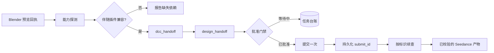

# Codex Dreamina 3D 插件


> 把已验证的 Blender 预览编排成可信的 Dreamina Seedance 成片——只提交一次，之后按标识续查。

[](https://github.com/partme-ai/codex-dreamina-3d-plugin)
[](LICENSE)

[English](README.md) | [简体中文](README.zh-CN.md) · [安装](#安装) · [快速开始](#快速开始) · [交接契约](#交接契约) · [故障排查](#故障排查)

## 项目定位

`codex-dreamina-3d` 是回执驱动的组合插件，而不是 DCC 实现。它接收已经通过自身验证的 Blender 预览，把配方交给 Dreamina Design，停在批准门禁，提交一次，然后凭已保存的 `submit_id` 恢复结果。

它不拥有建模、不拥有上传器、也不拥有计费逻辑。每一项相邻职责都留在已经实现它的插件手里。

### 适合谁

- 已经在用 Blender 插件、并希望把已验证预览变成 3D 成片的 3D 艺术家。
- 需要确定性交接、可持久台账且不会重复扣费的管线工程师。
- 需要看清"哪份预览产出了哪次提交、又卡在哪一步"的审阅者。

### 解决什么问题

| 问题 | 本插件提供 | 可验证入口 |
|---|---|---|
| 交接过程丢失状态 | 以 `submit_id` 为键的持久操作台账 | `scripts/job_ledger.py` |
| 重试导致重复扣费 | 重复提交会返回已保存的标识，而不是再次扣费 | `scripts/design_handoff.py` |
| 伴随插件版本漂移 | 能力探测会发现已安装的伴随版本 | `scripts/capability_probe.py` |
| 回执无法核实 | 回执驱动的交接校验器 | `scripts/handoff_validator.py` |

## 一眼看懂

```text
Blender 场景（已由 codex-blender 验证）
      │
      ▼
┌──────────────────────────────────────────────────────────┐
│ codex-dreamina-3d                                        │
│  ① probe      发现兼容的伴随插件                         │
│  ② validate   校验 DCC 预览回执                          │
│  ③ hand off   把配方交给 Dreamina Design                 │
│  ④ wait       停在真实的用户批准门禁                     │
│  ⑤ submit     只提交一次，并持久化 submit_id             │
│  ⑥ resume     按标识持续查询直到收敛                     │
└──────────────────────────────────────────────────────────┘
      │
      ▼
可信的 Seedance 成片产物 + 操作回执
```

| 项目属性 | 值 |
|---|---|
| 插件 ID | `codex-dreamina-3d` |
| 宿主 | Codex CLI 或 ChatGPT 桌面应用 |
| 当前版本 | `0.3.0` |
| 插件清单 | `.codex-plugin/plugin.json` |
| MCP 配置 | 无——插件通过 argv 与 JSON 编排伴随插件 |
| 主要语言 | Python 3.13 |
| 许可证 | Apache-2.0 |

## 能力与边界

### 已支持

| 能力 | 输入 | 输出 | 限制 | 状态 |
|---|---|---|---|---|
| 伴随发现 | 已安装的插件集合 | 兼容的 Blender 或 Maya 适配器，以及 Dreamina Design | 只读探测 | 稳定 |
| 预览校验 | 一份 DCC 预览回执 | 接受或拒绝该回执 | 回执被拒即中止流程 | 稳定 |
| 三入口路由 | Blender、即梦网页或自动 Seedance 路径 | 选定路径并给出理由 | 每次请求只走一条路径 | 稳定 |
| 提交 | 已批准的配方 | 一次提交与已持久化的 `submit_id` | 同一配方绝不提交两次 | 稳定 |
| 可恢复编排 | 一项已有操作 | 推进到完成或停在真实用户门禁 | 停在门禁，而不是强行推开 | 稳定 |
| 回执校验 | 返回的产物 | 已校验的回执 | — | 稳定 |

### 不负责

- 重复实现 Blender、媒体、认证、计费或 Dreamina CLI 逻辑。
- 静默安装伴随插件或 DCC 软件。
- 携带供应商上传器源码、捆绑 ffmpeg、仿制本地浏览器 Bridge 或私有 API。
- 把本地预览完成与远端生成完成当成同一个门禁。二者是分开的。
- 把 Autodesk Maya 当作生产运行环境。Maya 仍是实验性的夹具兼容路径，运行状态为 `NOT_RUN`。

### 成熟度

| 状态 | 含义 |
|---|---|
| 稳定 | 有自动化测试与已记录证据，可用于真实工作 |
| 实验性 | 仅用于契约演进，不作为生产运行环境宣传 |
| 封锁 / NOT_RUN | 未验证；不得描述为可用 |

## 架构与核心流程



### 组件职责

| 组件 | 负责 | 不负责 |
|---|---|---|
| `scripts/capability_probe.py` | 发现兼容的伴随插件安装 | 安装它们 |
| `scripts/dcc_handoff.py` | 与 DCC 适配器的 argv 和 JSON 边界 | DCC 内部实现 |
| `scripts/design_handoff.py` | 与 Dreamina Design 的边界及幂等提交 | 批准决策 |
| `scripts/auto_orchestrator.py` | 把单个任务推进到完成或真实门禁 | 强行推开外部门禁 |
| `scripts/job_ledger.py` | 操作回执的原子持久化 | 秘密存储 |
| `scripts/handoff_validator.py` | 回执校验 | 产物生成 |
| `skills/`（6 个） | 供 Codex 使用的路由与恢复指令 | 运行时强制 |

## 兼容性

| 插件版本 | 宿主 | 伴随插件 | 运行环境 | 状态 |
|---|---|---|---|---|
| `0.3.0` | Codex CLI 或 ChatGPT 桌面应用 | 固定版本的 `codex-blender` 与 `codex-dreamina-design` | macOS + Blender 5.2.1 LTS，Python 3.13 | 已验证 |
| `0.3.0` | Codex CLI 或 ChatGPT 桌面应用 | Maya 适配器夹具 | 任意 | 实验性；运行状态 `NOT_RUN` |

付费的 Dreamina 3D 到 Design MCP 端到端路径，以及官方网页运行环境，分别在 `docs/verification/` 中记录；在官方上传器就位之前，网页路径记为 `BLOCKED_MISSING_OFFICIAL_ADDON`。

## 安装

### 前置条件

- Python 3.13。
- 已安装 `codex-blender`，并且能够产出经验证的预览回执。
- 已安装 `codex-dreamina-design`，因为批准与计费边界由它负责。
- 预览侧需要 Blender 5.2.1 LTS。

### 从插件市场安装

```bash
codex plugin marketplace add partme-ai/codex-dreamina-3d-plugin --ref main
codex plugin add codex-dreamina-3d@partme-ai-dreamina-3d
```

重启 Codex 或 ChatGPT 桌面应用，然后新建任务以加载 Skills。

### 开发依赖

```bash
python3 -m pip install -r requirements-dev.txt
```

这会安装门禁所需的 `jsonschema` 与 `PyYAML`。

### 确认加载成功

```bash
codex plugin list
```

预期条目：

```text
codex-dreamina-3d@partme-ai-dreamina-3d  installed, enabled
```

再确认伴随插件可被发现：

```bash
python3 scripts/capability_probe.py
```

## 快速开始

### 1. 从已验证的预览开始

先完成 Blender 侧。预览回执就是输入契约；没有它，本插件会直接停下。

### 2. 让 Codex 出片

```text
把我已验证的 Blender 预览转成 Dreamina 3D 成片。先给我看报价。
```

预期观察：插件先探测伴随插件、校验预览回执，然后停在批准门禁并给出报价，而不是直接提交。

### 3. 批准一次，然后续查

你批准之后，插件只提交一次并保存 `submit_id`。如果等待过程被打断，直接要求续查：

```text
续查我的 Dreamina 3D 任务，不要重新提交。
```

预期观察：操作用已保存的标识查询，且不会产生新的付费动作。

## 配置

本插件没有配置文件。路由输入来自预览回执与已发现的伴随插件。

| 设置 | 所在位置 | 说明 |
|---|---|---|
| 伴随插件版本 | 已安装的 `codex-blender` 与 `codex-dreamina-design` | 由能力探测核实 |
| 操作台账 | 由 `scripts/job_ledger.py` 写入 | 带单调 revision 的原子写；仅非敏感字段 |
| 批准 | 由 `codex-dreamina-design` 持有 | 本插件只等待，不做决策 |

## 交接契约

### 操作状态

`Draft`、`DccSelected`、`PreviewSpecified`、`PreviewValidated`、`CapabilityResolved`、`Quoted`、`Approved`、`Submitted`、`Querying`、`Completed`、`Failed`、`Unknown`。

### 提交规则

- 设计插件返回的 `submit_id` 会先被持久化，然后才报告成功。
- 重复提交会返回此前保存的标识，且不产生新的付费动作。
- 回执只保存非敏感的标识、哈希、状态与时间戳。
- 失败模式不做自动重试；超时绝不构成重新提交的授权。

## 重试、幂等与恢复

- 单个任务一路推进到完成或真实的外部/用户门禁；编排器不会强行推开门禁。
- 恢复以已保存的 `submit_id` 为键；绝不为了绕开不确定结果而生成新标识。
- 台账写入是原子的（临时文件、fsync、替换），并带单调 revision。
- 在把结果报告为完成之前，先跑一遍回执校验。

## 数据与状态

| 数据 | 位置 | 生命周期 | 是否含秘密 |
|---|---|---|---|
| 操作回执 | 由 `scripts/job_ledger.py` 写入 | 直到你删除 | 否；仅标识、哈希、状态与时间戳 |
| 预览回执 | 由 `codex-blender` 产出 | 在校验时被消费 | 否 |
| 成片产物 | Dreamina 自身服务 | 由服务方持有 | 由伴随插件管理 |

## 安全

- 本仓库不含任何凭据；认证属于伴随插件。
- 只持久化非敏感字段：标识、哈希、状态与时间戳。
- 伴随插件边界只用 argv 与 JSON；不拼接 shell 字符串，也不复制私有 API。
- 插件绝不静默安装依赖；缺少伴随插件时如实报告，而不是绕开。
- 不捆绑供应商上传器；在用户自行安装之前，其运行门禁保持阻塞。

## 开发与验证

```bash
python3 scripts/ci_gate.py --strict
python3 -m unittest discover -s tests -v
python3 scripts/validate_distribution.py
python3 scripts/trace_gate.py
```

开发门禁接受 `--strict`。CI 门禁是权威入口。

仓库中已记录的证据：

- [端到端](docs/verification/end-to-end.md) 与[生产发布](docs/verification/production-release-2026-09-14.md)记录。
- [Blender 路径](docs/verification/blender-path.md)、[Dreamina 路径](docs/verification/dreamina-path.md) 与 [Maya 路径](docs/verification/maya-path.md)——其中 Maya 记录写明运行状态为 `NOT_RUN`。
- [离线验证](docs/verification/offline.md) 与 [TRACE](docs/verification/trace.md)。
- [Codex 插件合规](docs/verification/codex-plugin-compliance.md)。

## 故障排查

| 现象 | 优先检查 | 处理方式 |
|---|---|---|
| 探测报告没有伴随插件 | 是否安装 `codex-blender`、`codex-dreamina-design` | 安装缺失的伴随插件；本插件不会静默处理 |
| 预览回执被拒 | Blender 侧的验证结果 | 重跑 Blender 侧直到预览通过校验 |
| 流程停在报价处 | 批准门禁 | 在设计插件中批准，然后续查 |
| 任务看起来卡住 | 台账条目 | 用已保存的 `submit_id` 续查；不要再次提交 |
| 即梦网页不可用 | 是否安装官方上传器 | 用户自行安装前，该门禁保持阻塞 |
| 以为 Maya 可用 | 平台证据 | Maya 是实验性夹具路径，运行状态 `NOT_RUN` |

## 项目结构

```text
codex-dreamina-3d-plugin/
├── .codex-plugin/plugin.json   # 身份与展示元数据
├── .agents/plugins/marketplace.json
├── scripts/                    # 探测、交接、编排、台账、校验
├── skills/                     # 6 个路由与恢复 Skill
├── tests/                      # 单元、契约与门禁测试
└── docs/                       # 架构、技术方案、验证记录
```

## 深入文档

- [Architecture](docs/Codex-Dreamina-3D-Plugin-Architecture.md) · [架构文档](docs/Codex-Dreamina-3D-Plugin-Architecture.zh_CN.md)
- [Technical solution](docs/Codex-Dreamina-3D-Plugin-Technical-Solution.md) · [技术方案](docs/Codex-Dreamina-3D-Plugin-Technical-Solution.zh_CN.md)
- [设计规格](docs/superpowers/specs/2026-09-11-codex-dreamina-3d-plugin-design.md)
- [实施计划](docs/superpowers/plans/2026-09-11-codex-dreamina-3d-plugin-implementation.md)

## 贡献与支持

功能问题请提交到 <https://github.com/partme-ai/codex-dreamina-3d-plugin/issues>。提交变更前，请说明你验证所用的伴随插件版本、是否改动交接契约或台账格式，并附上受影响的门禁输出。

## 许可证

Apache-2.0，见 [LICENSE](LICENSE)。
