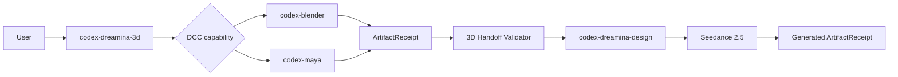
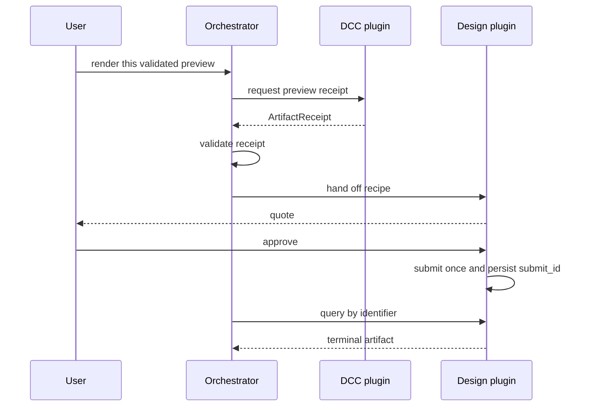
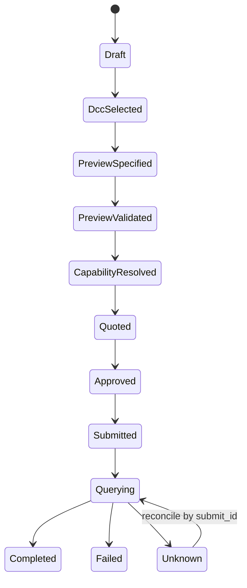

# Codex Dreamina 3D Plugin Architecture

> **Document control**
>
> | Field | Value |
> |---|---|
> | Status | Orchestration implemented; offline and fixture gates validated |
> | Scope | How this plugin composes a validated DCC preview into a Dreamina Seedance render |
> | Audience | Plugin maintainers, pipeline engineers, and reviewers |
> | Out of scope | DCC modelling, the Dreamina CLI, billing, and artifact lifetime |
> | Runtime evidence | `docs/verification/` |
> | Last structural revision | 2026-09-14 |

## 1. Executive summary

`codex-dreamina-3d` is a receipt-driven orchestrator. It does not model, render, upload, or bill. It takes a preview that a DCC plugin already validated, hands the recipe to the Dreamina Design integration, stops at the real approval gate, submits once, and then recovers the result by its stored identifier.

The architecture exists to make three guarantees enforceable:

- a companion is never duplicated, only composed;
- a submission is never repeated, only resumed;
- a local preview success is never reported as an end-to-end success.

## 2. Drivers and constraints

| Driver | Consequence for the architecture |
|---|---|
| Three plugins must cooperate without a hard dependency contract | Companions are discovered at runtime, and a missing companion stops the flow before any mutation or paid action |
| Remote generation is paid and irreversible | Submission is idempotent by identifier; approval belongs to the Design plugin |
| DCC export can fail locally | Local failures return to the DCC plugin and never advance the remote state |
| Remote state can be ambiguous | `Unknown` may only be reconciled by querying the existing `submit_id` |
| Vendor source must not be copied | Integration is limited to public CLI contracts and JSON receipts |

### Non-goals

- Reimplementing any DCC, media, authentication, billing, or Dreamina CLI logic.
- Installing companion plugins or DCC applications silently.
- Bundling the vendor uploader, a private ffmpeg build, or a browser bridge.
- Treating Maya as a production runtime. Maya remains an experimental fixture path whose runtime status is `NOT_RUN`.

## 3. Context and trust boundary



| Boundary | Inside | Outside |
|---|---|---|
| This plugin | Capability selection, receipt validation, prompt handoff, end-to-end state | Rendering, upload, billing |
| DCC companions | Scene inspection and preview export | Remote generation |
| The Design plugin | Capability, quotation, approval, submission, query, download | DCC work |
| The service | Seedance rendering and artifact lifetime | Everything above |

### Ownership

| Plugin | Owns |
|---|---|
| `codex-blender` | Blender scene inspection and preview export |
| `codex-maya` | Maya scene inspection and Playblast export |
| `codex-dreamina-design` | CLI capability, quotation, approval, submission, query, download |
| `codex-dreamina-3d` | capability selection, receipt validation, prompt handoff, end-to-end state |

## 4. Current state, target state, and gaps

| Capability | Current | Target | Gap |
|---|---|---|---|
| Companion discovery | Implemented offline | Same | Live discovery is exercised by the runtime gate |
| Preview receipt validation | Implemented | Same | None |
| Blender to Seedance path | Implemented; paid end-to-end recorded `NOT_RUN` | Authorized live acceptance | Requires separate authorization |
| Jimeng Web route | Recorded `BLOCKED_MISSING_OFFICIAL_ADDON` | Available once the uploader is installed | User-installed dependency |
| Maya path | Fixture-compatible, runtime `NOT_RUN` | Contract evolution only | Not advertised as production |
| End-to-end state | Implemented with a durable ledger | Same | None |

No row claims more than its evidence supports; the two `NOT_RUN` lines are deliberate.

## 5. Principles and decisions

| Decision | Rationale | Reversal condition |
|---|---|---|
| Compose, never duplicate | Each responsibility already has an owner; a second implementation would drift | None |
| Discover companions at runtime | Codex manifests do not provide a dependable hard cross-plugin dependency contract | If a manifest-level dependency contract becomes available |
| Persist `submit_id` before reporting success | A persisted identifier is what makes resume possible after a crash | None |
| Stop at the real user gate | The orchestrator advances work; it does not force approvals | None |
| Keep `Unknown` terminal until reconciled | Guessing would risk a second paid action | None |

## 6. Components and dependencies

| Component | Owns | Does not own |
|---|---|---|
| `scripts/capability_probe.py` | Discovering compatible companion installations | Installing them |
| `scripts/dcc_handoff.py` | The argv and JSON boundary with a DCC adapter | DCC internals |
| `scripts/design_handoff.py` | The boundary with the Design plugin and idempotent submission | Approval decisions |
| `scripts/handoff_validator.py` | Receipt validation | Artifact generation |
| `scripts/auto_orchestrator.py` | Advancing one job until completion or a real gate | Forcing a gate open |
| `scripts/job_ledger.py` | Atomic persistence of operation receipts | Secret storage |
| `skills/` (6) | Routing and recovery instructions for Codex | Runtime enforcement |

## 7. Runtime and core flows

### 7.1 Primary flow



### 7.2 Job state



### 7.3 Handoff contract

The incoming `ArtifactReceipt` must contain schema version, producer plugin/version, path, SHA-256, codec, dimensions, fps, duration, bytes, camera, frame range, preview mode, and restoration evidence. The orchestrator rejects stale files, hash mismatch, unsupported media, or unconfirmed restoration.

### 7.4 Failure and recovery

| Failure | Detection | Behavior | Recovery |
|---|---|---|---|
| Companion missing | Capability probe | Stops before any mutation or paid action | Install the companion and retry |
| Preview stale or hash mismatch | Receipt validation | Rejected | Re-export the preview |
| Restoration unconfirmed | Receipt validation | Rejected | Re-run the DCC export |
| Quote or approval invalidated | Quote binding | Approval must be re-obtained | Change nothing and re-approve |
| Duplicate submit attempt | Ledger lookup | Returns the stored `submit_id`, takes no paid action | None needed |
| Timeout or ambiguous submit | Adapter outcome | Ledger records `Unknown` | Query the existing identifier |
| Artifact mismatch | Receipt validation | Reported as failure | Query again; do not resubmit |

Local export failures return to the DCC plugin. Remote unknown state returns to the Design operation ledger. The orchestrator never retries either side blindly and never converts one gate's success into end-to-end completion.

## 8. State, data, and protocol

| Data | Owner | Location | Consistency |
|---|---|---|---|
| Operation receipt | This plugin | Written by `scripts/job_ledger.py` | Atomic write with a monotonic revision; keyed by `submit_id` |
| Preview receipt | DCC plugin | Consumed at validation | Rejected on any mismatch |
| Quote and approval | Design plugin | Design-owned store | Bound to the exact recipe |
| Render artifact | Service | Service-owned | Reached through the Design plugin |

Integration is a local JSON contract plus argv. No companion module is imported, and no private API is replicated.

## 9. Security

- No credential lives in this repository; the Design plugin owns authentication and billing.
- Only non-secret fields are persisted: identifiers, hashes, states, and timestamps.
- Companion boundaries are argv and JSON only; no shell string is constructed.
- The plugin never installs a dependency silently; a missing companion is reported, not worked around.
- The vendor uploader is not bundled, so its runtime gate stays blocked until the user installs it.
- Clean-room discipline: vendor behavior informs tests, while the implementation relies on public contracts.

## 10. Resource and operational budgets

| Budget | Value | Rationale |
|---|---|---|
| Paid submissions per approved recipe | One | A duplicate identifier is how one paid action becomes two |
| Ledger writes | Atomic and revisioned | A crash must not lose the identifier |
| Gate advancement | One step per call | The orchestrator must not force an external gate |
| Companion compatibility | Pinned revisions | Drift between companions is caught before a paid action |

### Operations

```bash
python3 scripts/ci_gate.py --strict
python3 scripts/trace_gate.py
python3 scripts/validate_distribution.py
python3 scripts/local_install.py --verify
```

## 11. Deployment, compatibility, and evolution

| Aspect | Position |
|---|---|
| Distribution | Codex marketplace entry pointing at this repository, pinned to `main` |
| Python | 3.13 |
| Companions | `codex-blender` and `codex-dreamina-design`, both pinned to verified revisions |
| Compatibility | Three-entry routing: Blender, Jimeng Web, automatic Seedance |
| Rollback | Revert the plugin; the ledger identifies in-flight operations so none is silently lost |

| Risk | Mitigation |
|---|---|
| Companion drift | Capability probe plus pinned revisions in CI |
| Duplicate spend | Idempotent submission keyed by the persisted identifier |
| Overstated readiness | Maya, the paid end-to-end path, and the official Web route are recorded as not-run or blocked |

## 12. Evidence map

| Claim | Evidence |
|---|---|
| Companion discovery | `scripts/capability_probe.py` |
| Receipt contract | `scripts/handoff_validator.py` and `docs/verification/blender-path.md` |
| Idempotent submission | `scripts/design_handoff.py` and `scripts/job_ledger.py` |
| Blender path | `docs/verification/blender-path.md` |
| Dreamina path | `docs/verification/dreamina-path.md` |
| Maya status | `docs/verification/maya-path.md` (runtime `NOT_RUN`) |
| End-to-end and release | `docs/verification/end-to-end.md`, `docs/verification/production-release-2026-09-14.md` |
