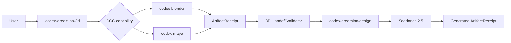
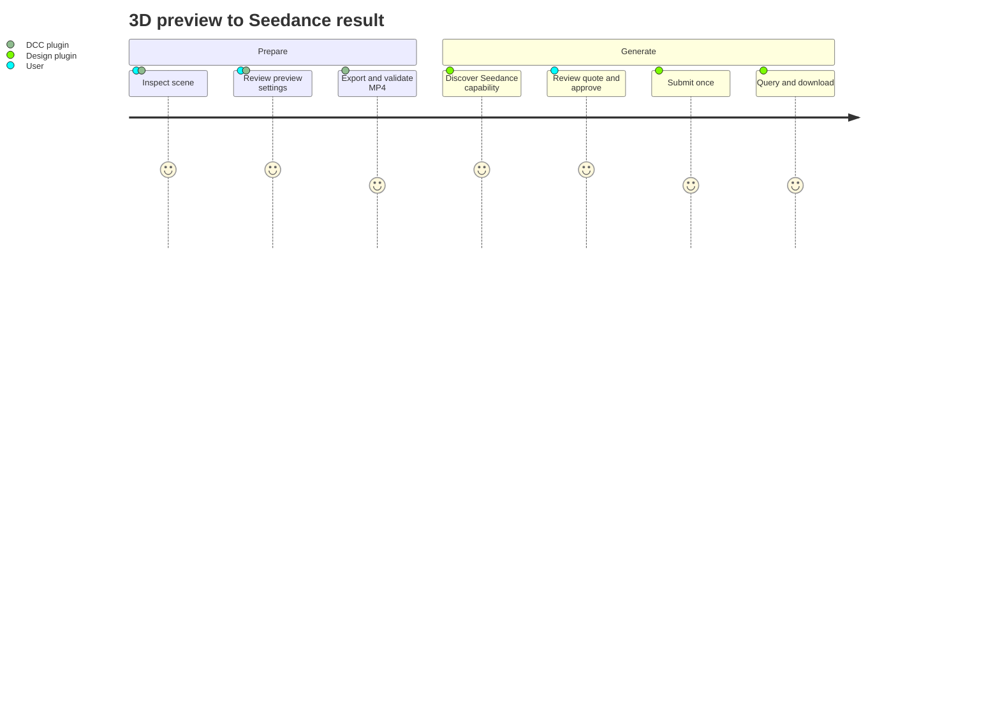

# Codex Dreamina 3D Plugin Architecture

> Target orchestration architecture, not implemented. Updated 2026-09-11.

## Context

## Ownership

| Plugin | Owns |
|---|---|
| `codex-blender` | Blender scene inspection and preview export |
| `codex-maya` | Maya scene inspection and Playblast export |
| `codex-dreamina-design` | CLI capability, quotation, approval, submission, query, download |
| `codex-dreamina-3d` | capability selection, receipt validation, prompt handoff, end-to-end state |

## Journey

## Handoff contract

The incoming `ArtifactReceipt` must contain schema version, producer plugin/version, path, SHA-256, codec, dimensions, fps, duration, bytes, camera, frame range, preview mode, and restoration evidence. The orchestrator rejects stale files, hash mismatch, unsupported media, or unconfirmed restoration.

## Failure and recovery

Local export failures return to the DCC plugin. Remote unknown state returns to the Design operation ledger. The orchestrator never retries either side blindly and never converts one gate's success into end-to-end completion.

## Dependency model

Codex manifests do not currently provide a dependable hard cross-plugin dependency contract for this design. Runtime detection and clear install guidance are used; missing companions stop before any mutation or paid action.
