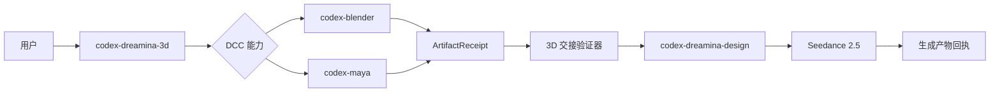
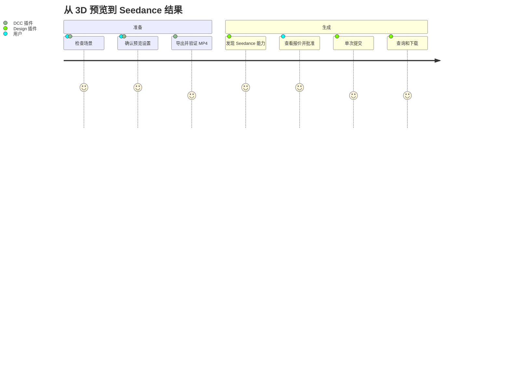

# Codex Dreamina 3D 插件架构

> 目标编排架构，尚未实现。更新日期 2026-09-11。

## 系统上下文

## 职责归属

| 插件 | 负责 |
|---|---|
| `codex-blender` | Blender 场景检查与预览导出 |
| `codex-maya` | Maya 场景检查与 Playblast 导出 |
| `codex-dreamina-design` | CLI 能力、报价、批准、提交、查询、下载 |
| `codex-dreamina-3d` | 能力选择、回执验证、Prompt 交接和端到端状态 |

## 用户旅程

## 交接契约

输入 `ArtifactReceipt` 必须包含 schema 版本、生产者插件/版本、路径、SHA-256、编码、尺寸、帧率、时长、字节数、相机、帧范围、预览模式和恢复证据。过期文件、哈希不匹配、不支持媒体或未确认恢复都会被拒绝。

## 故障与恢复

本地导出失败回到 DCC 插件；远程状态不确定回到 Design 操作台账。编排器不盲目重试任一侧，也不把单个门禁成功当作端到端完成。

## 依赖模型

当前 Codex manifest 没有可依赖的跨插件硬依赖契约，因此采用运行时检测和明确安装指引；缺少伴随插件时，在任何修改或付费动作前停止。
