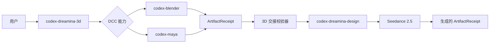
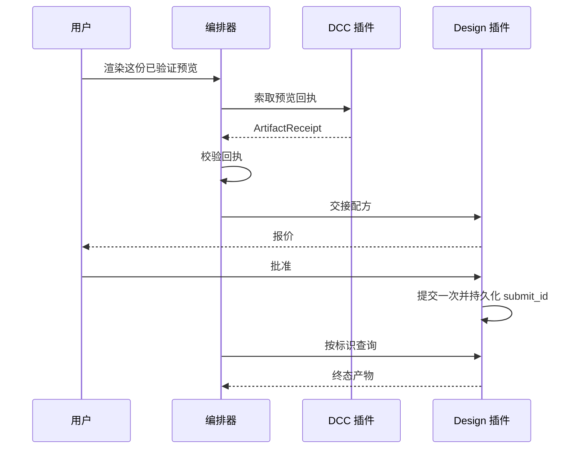
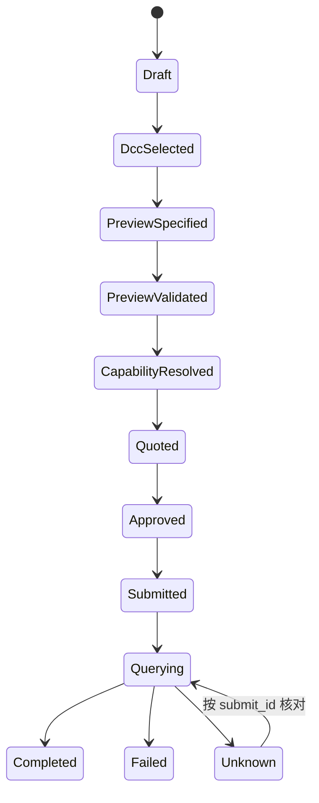

# Codex Dreamina 3D 插件架构

> **文档信息**
>
> | 字段 | 值 |
> |---|---|
> | 状态 | 编排已实现；离线与夹具门禁已验证 |
> | 范围 | 本插件如何把已验证的 DCC 预览组合成 Dreamina Seedance 成片 |
> | 读者 | 插件维护者、管线工程师与审阅者 |
> | 不在范围 | DCC 建模、Dreamina CLI、计费与产物生命周期 |
> | 运行证据 | `docs/verification/` |
> | 最近一次结构修订 | 2026-09-14 |

## 1. 执行摘要

`codex-dreamina-3d` 是回执驱动的编排器。它不建模、不渲染、不上传、不计费。它接收 DCC 插件已经验证过的预览，把配方交给 Dreamina Design 集成，停在真实的批准门禁，只提交一次，之后凭已保存的标识恢复结果。

架构存在的意义，是让三条保证在代码里可被强制：

- 伴随插件只被组合，绝不被重复实现；
- 提交只被恢复，绝不被重复；
- 本地预览的成功绝不报告为端到端成功。

## 2. 驱动力与约束

| 驱动力 | 对架构的后果 |
|---|---|
| 三个插件必须协作，但没有硬依赖契约 | 伴随插件在运行时发现；缺失即停下，且发生在任何改动或付费动作之前 |
| 远端生成付费且不可逆 | 提交按标识幂等；批准属于 Design 插件 |
| DCC 导出可能在本地失败 | 本地失败回到 DCC 插件，绝不推进远端状态 |
| 远端状态可能含糊 | `Unknown` 只能通过查询已有 `submit_id` 来核对 |
| 不得复制供应商源码 | 集成仅限公开 CLI 契约与 JSON 回执 |

### 非目标

- 重实现任何 DCC、媒体、认证、计费或 Dreamina CLI 逻辑。
- 静默安装伴随插件或 DCC 软件。
- 捆绑供应商上传器、私有 ffmpeg 构建或浏览器桥。
- 把 Maya 当作生产运行环境。Maya 仍是实验性夹具路径，运行状态为 `NOT_RUN`。

## 3. 上下文与信任边界



| 边界 | 内部 | 外部 |
|---|---|---|
| 本插件 | 能力选择、回执校验、Prompt 交接、端到端状态 | 渲染、上传、计费 |
| DCC 伴随插件 | 场景检查与预览导出 | 远端生成 |
| Design 插件 | 能力、报价、批准、提交、查询、下载 | DCC 工作 |
| 服务 | Seedance 渲染与产物生命周期 | 以上全部之外 |

### 归属

| 插件 | 拥有 |
|---|---|
| `codex-blender` | Blender 场景检查与预览导出 |
| `codex-maya` | Maya 场景检查与 Playblast 导出 |
| `codex-dreamina-design` | CLI 能力、报价、批准、提交、查询、下载 |
| `codex-dreamina-3d` | 能力选择、回执校验、Prompt 交接、端到端状态 |

## 4. 当前状态、目标状态与差距

| 能力 | 当前 | 目标 | 差距 |
|---|---|---|---|
| 伴随插件发现 | 离线已实现 | 不变 | 实机发现由运行门禁覆盖 |
| 预览回执校验 | 已实现 | 不变 | 无 |
| Blender 到 Seedance 路径 | 已实现；付费端到端记录为 `NOT_RUN` | 经授权的实机验收 | 需要单独授权 |
| 即梦网页路径 | 记录为 `BLOCKED_MISSING_OFFICIAL_ADDON` | 用户安装上传器后可用 | 用户自装依赖 |
| Maya 路径 | 夹具兼容，运行状态 `NOT_RUN` | 仅契约演进 | 不作为生产环境宣传 |
| 端到端状态 | 已实现，带持久台账 | 不变 | 无 |

没有任何一行声称超出其证据；两条 `NOT_RUN` 是刻意的。

## 5. 原则与决策

| 决策 | 理由 | 反转条件 |
|---|---|---|
| 只组合，不重复 | 每项职责都已有归属，第二份实现必然漂移 | 无 |
| 运行时发现伴随插件 | Codex 清单目前不提供可靠的硬跨插件依赖契约 | 若清单级依赖契约可用 |
| 报告成功之前先持久化 `submit_id` | 已持久化的标识才是崩溃后可恢复的依据 | 无 |
| 停在真实用户门禁 | 编排器的职责是推进工作，而不是强行推动批准 | 无 |
| `Unknown` 保持终态直到核对 | 猜测会带来第二次付费动作的风险 | 无 |

## 6. 组件与依赖

| 组件 | 负责 | 不负责 |
|---|---|---|
| `scripts/capability_probe.py` | 发现兼容的伴随插件安装 | 安装它们 |
| `scripts/dcc_handoff.py` | 与 DCC 适配器的 argv 与 JSON 边界 | DCC 内部实现 |
| `scripts/design_handoff.py` | 与 Design 插件的边界及幂等提交 | 批准决策 |
| `scripts/handoff_validator.py` | 回执校验 | 产物生成 |
| `scripts/auto_orchestrator.py` | 把单个任务推进到完成或真实门禁 | 强行推开门禁 |
| `scripts/job_ledger.py` | 操作回执的原子持久化 | 秘密存储 |
| `skills/`（6 个） | 供 Codex 使用的路由与恢复指令 | 运行时强制 |

## 7. 运行期与核心流程

### 7.1 主流程



### 7.2 任务状态



### 7.3 交接契约

传入的 `ArtifactReceipt` 必须包含 schema 版本、生产插件与版本、路径、SHA-256、编码、尺寸、fps、时长、字节数、相机、帧范围、预览模式与还原证据。编排器会拒绝过期文件、哈希不匹配、不支持的媒体，以及未经确认的还原。

### 7.4 失败与恢复

| 失败 | 检测方式 | 行为 | 恢复 |
|---|---|---|---|
| 伴随插件缺失 | 能力探测 | 在任何改动或付费动作之前停下 | 安装伴随插件后重试 |
| 预览过期或哈希不匹配 | 回执校验 | 拒绝 | 重新导出预览 |
| 还原未确认 | 回执校验 | 拒绝 | 重跑 DCC 导出 |
| 报价或批准失效 | 报价绑定 | 必须重新获得批准 | 不改动内容，重新批准 |
| 重复提交 | 台账查询 | 返回已保存的 `submit_id`，不产生付费动作 | 无需处理 |
| 超时或提交含糊 | 适配器结果 | 台账记为 `Unknown` | 查询已有标识 |
| 产物不匹配 | 回执校验 | 报告为失败 | 再次查询；不要重新提交 |

本地导出失败回到 DCC 插件；远端未知状态回到 Design 的操作台账。编排器绝不盲目重试任何一侧，也绝不把单一门禁的成功当作端到端完成。

## 8. 状态、数据与协议

| 数据 | 所有者 | 位置 | 一致性 |
|---|---|---|---|
| 操作回执 | 本插件 | 由 `scripts/job_ledger.py` 写入 | 带单调 revision 的原子写；以 `submit_id` 为键 |
| 预览回执 | DCC 插件 | 在校验时被消费 | 任何不匹配即拒绝 |
| 报价与批准 | Design 插件 | Design 自有存储 | 绑定到确切配方 |
| 成片产物 | 服务 | 服务方持有 | 通过 Design 插件触达 |

集成方式是本机 JSON 契约加 argv。不导入任何伴随插件的模块，也不复制私有 API。

## 9. 安全

- 本仓库不含任何凭据；认证与计费由 Design 插件负责。
- 只持久化非敏感字段：标识、哈希、状态与时间戳。
- 伴随插件边界只用 argv 与 JSON；不拼接 shell 字符串。
- 插件绝不静默安装依赖；缺少伴随插件时如实报告，而不是绕开。
- 不捆绑供应商上传器，因此在用户自行安装之前其运行门禁保持阻塞。
- 洁净室纪律：供应商行为用于指导测试，而实现只依赖公开契约。

## 10. 资源与运行预算

| 预算 | 值 | 理由 |
|---|---|---|
| 每份已批准配方的付费提交次数 | 一次 | 重复标识就是一次付费动作变成两次的方式 |
| 台账写入 | 原子且带 revision | 崩溃不得丢失标识 |
| 门禁推进 | 每次调用只推进一步 | 编排器不得强行推开外部门禁 |
| 伴随兼容性 | 固定版本 | 在付费动作之前就发现漂移 |

### 运行

```bash
python3 scripts/ci_gate.py --strict
python3 scripts/trace_gate.py
python3 scripts/validate_distribution.py
python3 scripts/local_install.py --verify
```

## 11. 部署、兼容性与演进

| 方面 | 立场 |
|---|---|
| 分发 | 指向本仓库、固定到 `main` 的 Codex marketplace 条目 |
| Python | 3.13 |
| 伴随插件 | `codex-blender` 与 `codex-dreamina-design`，均固定到已验证版本 |
| 兼容性 | 三入口路由：Blender、即梦网页、自动 Seedance |
| 回滚 | 回退插件即可；台账能识别在途操作，不会静默丢失 |

| 风险 | 缓解 |
|---|---|
| 伴随插件漂移 | 能力探测 + CI 中的固定版本 |
| 重复花费 | 以已持久化标识为键的幂等提交 |
| 过度声称就绪 | Maya、付费端到端路径与官方网页路径均记录为未运行或阻塞 |

## 12. 证据映射

| 断言 | 证据 |
|---|---|
| 伴随插件发现 | `scripts/capability_probe.py` |
| 回执契约 | `scripts/handoff_validator.py` 与 `docs/verification/blender-path.md` |
| 幂等提交 | `scripts/design_handoff.py` 与 `scripts/job_ledger.py` |
| Blender 路径 | `docs/verification/blender-path.md` |
| Dreamina 路径 | `docs/verification/dreamina-path.md` |
| Maya 状态 | `docs/verification/maya-path.md`（运行状态 `NOT_RUN`） |
| 端到端与发布 | `docs/verification/end-to-end.md`、`docs/verification/production-release-2026-09-14.md` |
