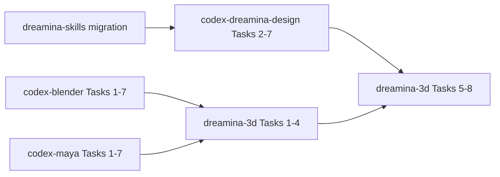

# Codex Dreamina 3D Plugin Implementation Plan

> **For agentic workers:** REQUIRED SUB-SKILL: Use superpowers:subagent-driven-development (recommended) or superpowers:executing-plans to implement this plan task-by-task. Steps use checkbox (`- [ ]`) syntax for tracking.

**Goal:** Build receipt-driven Blender/Maya to Seedance 2.5 orchestration for Codex.

**Architecture:** Runtime capability discovery selects a DCC companion. A handoff validator and end-to-end ledger coordinate the companion artifact with `codex-dreamina-design` without sharing implementation internals.

**Tech Stack:** Codex plugin, Agent Skills, Python, JSON Schema, unittest/pytest.

**Spec:** `docs/superpowers/specs/2026-09-11-codex-dreamina-3d-plugin-design.md`

## Constraints

- ID `codex-dreamina-3d`.
- Companion plugins are runtime-discovered, never silently installed.
- Receipt/hash validation precedes capability discovery or quotation.
- Paid submission is delegated and at-most-once.
- Vendor code and bridge protocols are excluded.

## Foundation baseline completed 2026-09-12

The repository already contains the validated `codex-dreamina-3d` compatibility manifest, URL marketplace entry, Apache-2.0/legal files, transparent brand assets, implementation directories, distribution validator, and RED/GREEN foundation tests. Tasks below extended these files rather than recreating or overwriting them. As of 2026-09-13, Tasks 1–7 and the fixture portion of Task 8 are implemented and freshly verified; authorized real-runtime gates remain open.

### Task 1: Shared contract conformance
- [x] Write failing tests using planned Blender/Maya ArtifactReceipt fixtures.
- [x] Define `3d_job` and compatibility schemas plus handoff validator.
- [x] Reject stale/hash-mismatched/unrestored artifacts; commit `feat: define Dreamina 3D handoff`.

### Task 2: Companion capability discovery
- [x] Write failing tests for none/one/both/incompatible companions.
- [x] Implement deterministic selection and explicit user choice for ambiguity.
- [x] Prove no installation side effect; commit `feat: discover 3D companion plugins`.

### Task 3: End-to-end job ledger
- [x] Write failing transition, atomicity, restart and corrupted-ledger tests.
- [x] Implement the specified state machine and receipt references without secrets.
- [x] Prove invalid transitions fail closed; commit `feat: persist Dreamina 3D jobs`.

### Task 4: Design-plugin handoff
- [x] Write failing tests for capability resolution, quote binding, changed inputs, submit-once and unknown results.
- [x] Implement only the public receipt interface to `codex-dreamina-design`.
- [x] Prove timeout queries instead of resubmits; commit `feat: orchestrate Seedance generation`.

### Task 5: Agent Skills
- [x] Baseline no-skill scenarios for silent installs, stale previews, and paid retries.
- [x] Create and individually validate use/from-blender/from-maya/resume Skills.
- [x] Run TRACE and forward scenarios; commit `feat: add Dreamina 3D workflows`.

### Task 6: Distribution and cross-plugin acceptance
- [x] Add failing identity/marketplace/link/secret/contract-version tests.
- [x] Implement validator and public marketplace entry.
- [x] Run fake-companion E2E tests and validate all three plugin packages.
- [x] Record real Blender, Maya, and paid Dreamina gates separately; commit `test: verify Dreamina 3D distribution`.

---

## Detailed executor contract

### Task 1 — shared receipt and job schemas

**Files:** `.codex-plugin/plugin.json`, `.agents/plugins/marketplace.json`, `schemas/artifact_receipt.schema.json`, `schemas/3d_job.schema.json`, `scripts/handoff_validator.py`, `tests/fixtures/blender_artifact.json`, `tests/fixtures/maya_artifact.json`, `tests/test_handoff_validator.py`.

```python
def validate_artifact(receipt: dict, current_file: Path) -> list[str]: ...
def compatible_producer(receipt: dict, supported_versions: dict) -> bool: ...
```

- [x] RED-test plugin ID `codex-dreamina-3d`, producer IDs `codex-blender|codex-maya`, receipt schema version, producer version range, path scope, file existence, SHA-256, codec, dimensions, fps, duration, bytes and `restoration.status=confirmed`.
- [x] Reject a file whose stat/hash changes while validation runs.
- [x] Implement a closed `3d_job` schema referencing receipts by immutable ID/hash rather than embedding secrets.
- [x] Run contract tests and plugin validator; commit.

### Task 2 — companion detection and selection

**Files:** `scripts/capability_probe.py`, `tests/test_capability_probe.py`.

```python
@dataclass(frozen=True)
class Companion:
    plugin_id: str
    version: str
    executable: Path
    contract_versions: tuple[str, ...]

def discover_companions(search_roots: tuple[Path, ...]) -> list[Companion]: ...
def select_companion(candidates: list[Companion], requested: str | None) -> Companion: ...
```

- [x] RED-test zero, Blender-only, Maya-only, both without choice, explicit valid choice, incompatible contract and duplicate/stale installation.
- [x] Discover through stable installed-plugin metadata or an explicit adapter executable; do not crawl unrelated user directories.
- [x] Missing companion returns exact installation guidance but performs no install.
- [x] Both companions require user selection unless the request explicitly names Blender/Maya.
- [x] Run tests and commit.

### Task 3 — end-to-end job ledger

**Files:** `scripts/job_ledger.py`, `tests/test_job_ledger.py`.

```python
class JobState(str, Enum):
    DRAFT = "Draft"
    DCC_SELECTED = "DccSelected"
    PREVIEW_SPECIFIED = "PreviewSpecified"
    PREVIEW_VALIDATED = "PreviewValidated"
    CAPABILITY_RESOLVED = "CapabilityResolved"
    QUOTED = "Quoted"
    APPROVED = "Approved"
    SUBMITTED = "Submitted"
    QUERYING = "Querying"
    COMPLETED = "Completed"
    FAILED = "Failed"
    UNKNOWN = "Unknown"
```

- [x] RED-test every allowed transition, every direct transition that skips a gate, concurrent update conflict, truncated/corrupt ledger, restart and stale receipt reference.
- [x] Implement atomic write-to-temp/fsync/replace with monotonic revision.
- [x] Store only non-secret IDs, hashes, states, timestamps and error categories.
- [x] Require a new quote after any preview hash, prompt, reference, model, resolution, ratio or duration change.
- [x] Run state tests and commit.

### Task 4 — DCC preview orchestration

**Files:** `scripts/dcc_handoff.py`, `tests/fakes/fake_blender_adapter.py`, `tests/fakes/fake_maya_adapter.py`, `tests/test_dcc_handoff.py`.

- [x] RED-test inspect-before-export, user-approved camera/range/output, adapter error, timeout, restoration unknown, stale output and unsupported media.
- [x] Invoke companions via argv and JSON receipts; never import their internal Python modules.
- [x] Preserve the exact producer receipt and independently re-hash the artifact.
- [x] On timeout, query adapter status if supported or return local `Unknown`; never repeat the export automatically.
- [x] Run both fake-companion paths and commit.

### Task 5 — Dreamina Design handoff

**Files:** `scripts/design_handoff.py`, `tests/fakes/fake_design_adapter.py`, `tests/test_design_handoff.py`.

- [x] RED-test missing design plugin, capability mismatch, web prerequisite, quote mismatch, rejected/expired approval, duplicate submission, unknown state, resume and artifact mismatch.
- [x] Send a normalized multimodal request containing the validated preview receipt/hash and user prompt; do not send DCC scene data.
- [x] Delegate quote, approval, submit, query and download through the public `codex-dreamina-design` receipt interface.
- [x] Persist the returned submit ID before reporting submission success.
- [x] Prove timeout enters `Unknown` and only queries; commit.

### Task 6 — Agent workflows

**Files:** `skills/codex-dreamina-3d-use/`, `skills/codex-dreamina-3d-from-blender/`, `skills/codex-dreamina-3d-from-maya/`, `skills/codex-dreamina-3d-resume/`, `tests/scenarios/`.

- [x] Capture no-skill baselines for silent companion install, ambiguous DCC choice, unvalidated preview, quote reuse, paid retry and false end-to-end completion.
- [x] Implement the router and three bounded workflows one at a time.
- [x] Each Skill must distinguish local preview status, Dreamina submission status and final artifact acceptance.
- [x] After each Skill run quick validation, strict TRACE and fresh-context behavior scenarios.
- [x] Verify resume starts from ledger state and never repeats completed local/remote actions; commit.

### Task 7 — clean-room provenance and distribution

**Files:** `docs/research/seedance-2.5-uploader-behavior.md`, `scripts/validate_distribution.py`, `tests/test_distribution.py`, `docs/verification/offline.md`.

- [x] Record only observed external behavior: official Blender package 1.0.0, SHA-256 `471b315b8da91023be46496f902f7d64c1b48b91567d10cd442de7dffe0d68ae`, camera/local modes, restoration, H.264 MP4 and protocol-driven constraints.
- [x] Explicitly exclude vendor source, UI strings, identifiers, local bridge protocol and bundled ffmpeg from implementation inputs.
- [x] RED-test plugin identity, repository URL, four Skills, contract versions, links, licenses, symlinks, caches and secret patterns.
- [x] Run all offline unit/integration tests, plugin and Skill validators, TRACE, link audit and `git diff --check`.
- [x] Install locally and verify source/cache parity plus fresh-task Skill discovery; commit.

### Task 8 — cross-plugin runtime acceptance

**Files:** `docs/verification/blender-path.md`, `docs/verification/maya-path.md`, `docs/verification/dreamina-path.md`, `docs/verification/end-to-end.md`.

- [x] Validate `codex-blender` fixture path without Dreamina and record its receipt.
- [x] Validate `codex-maya` fixture path without Dreamina and record its receipt.
- [x] Validate both receipts through this plugin using fake `codex-dreamina-design`; no network or credits.
- [ ] With explicit runtime authorization, run one local Blender and one local Maya path; keep unsupported environments blocked rather than inferred.
- [x] With separate action-time approval, run at most one low-cost Seedance canary; otherwise record `paidCanary=NOT_RUN`.
- [x] Prove end-to-end completion requires a validated final artifact, not HTTP/CLI success alone.
- [x] Commit fixture/runtime-blocker evidence separately from offline evidence and stop for integration choice.

## Cross-repository execution order



The Canvas plugin is independent and may execute after the shared Skill migration. The Design plugin must publish its receipt contract before Dreamina 3D Task 5.

## Completion gate

```text
receipt_contract_tests = PASS
companion_detection_tests = PASS
job_state_tests = PASS
fake_blender_handoff = PASS
fake_maya_handoff = PASS
fake_design_handoff = PASS
skill_quick_validation = 4/4
skill_trace = 4/4
plugin_validation = PASS
source_cache_parity = PASS
secret_matches = 0
local_blender_runtime = PASS or explicit blocker
local_maya_runtime = PASS or explicit blocker
paid_seedance_canary = separately approved or NOT_RUN
```
