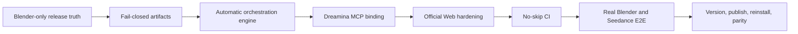

# Dreamina 3D Production Readiness Implementation Plan

> **For agentic workers:** REQUIRED SUB-SKILL: Use superpowers:subagent-driven-development (recommended) or superpowers:executing-plans to implement this plan task-by-task. Steps use checkbox (`- [ ]`) syntax for tracking.

**Goal:** Make the macOS Blender-to-Seedance workflow genuinely production-ready with executable automatic orchestration, fail-closed artifact acceptance, conditional official-Web handoff, complete CI evidence, and a fresh Marketplace release.

**Architecture:** `codex-dreamina-3d` owns the durable workflow reducer and job ledger but does not import companion implementations. Blender operations use the `ArtifactReceipt 1.0.0` adapter/Harness contracts; paid generation uses the installed `codex-dreamina-design` MCP tools through an injected tool-invocation port. The first production release is Blender/macOS only; Maya remains implemented as an experimental fixture path but is removed from production-facing claims.

**Tech Stack:** Python 3.13, Codex Agent Skills, JSON Schema, Blender Harness JSON protocol, Dreamina Design MCP/JSON-RPC, unittest, GitHub Actions, ffprobe.

**Specs:**
- `docs/superpowers/specs/2026-09-11-codex-dreamina-3d-plugin-design.md`
- `../codex-blender-plugin/docs/superpowers/specs/2026-09-13-official-uploader-dual-channel-design.md`
- `../codex-dreamina-design-plugin/docs/superpowers/specs/2026-09-13-dreamina-mcp-full-automation-design.md`

## Global Constraints

- Production scope is macOS + Blender 5.2.1 LTS + Dreamina Design MCP 0.3.x.
- Maya is not a production claim until a licensed Maya runtime passes the same gates.
- A Jimeng Web link terminates at `JimengLinkReady`; it is never Seedance `Completed`.
- A paid request is submitted at most once. `Submitted`, `Querying`, and `Unknown` are query-only states.
- The current official CLI exposes task-attributed cost only after submission and has no authoritative quote command. Numeric `max_charge` must therefore block before submit when no authoritative preflight quote exists; it must never be presented as enforced based on an estimate.
- `Completed` requires a downloaded regular file, expected media metadata, byte count, and independently matched SHA-256.
- Paid calls require the Dreamina Design server-side native approval; host MCP metadata alone is insufficient.
- Never install or enable the official Blender uploader silently.
- Never commit secrets, OAuth artifacts, loopback tokens, absolute private paths, generated media, caches, or runtime ledgers.
- Preserve unrelated changes. The current `codex-blender-plugin` main checkout is dirty and must not be modified until its owner reconciles or explicitly authorizes those edits.
- Each repository keeps its own specification and commits; no cross-repository implementation imports.

## Release Gate Summary



---

### Task 1: Freeze baselines and correct the production scope

**Files:**
- Modify: `.codex-plugin/plugin.json`
- Modify: `README.md`
- Modify: `README.zh-CN.md`
- Modify: `skills/codex-dreamina-3d-use/SKILL.md`
- Modify: `skills/codex-dreamina-3d-from-maya/SKILL.md`
- Modify: `docs/verification/end-to-end.md`
- Create: `docs/verification/production-baseline-2026-09-14.md`
- Test: `tests/test_distribution.py`
- Test: `tests/test_skills.py`

**Interfaces:**
- Produces: an enforceable release matrix containing only `blender/macos`.
- Preserves: Maya fixture compatibility without advertising runtime support.

- [x] **Step 1: Record immutable baselines**

Capture local/tracking/remote SHA, status, manifest version, installed-cache path, latest CI run, Python version, Blender version, Dreamina Design version, and current explicit blockers for all three repositories. Record but do not absorb the dirty Blender working tree.

- [x] **Step 2: Write failing release-claim tests**

```python
def test_manifest_does_not_advertise_unverified_maya_runtime(self):
    manifest = load_json(".codex-plugin/plugin.json")
    self.assertNotIn("Maya", json.dumps(manifest))

def test_maya_skill_is_explicitly_experimental(self):
    _, body = _load_skill("codex-dreamina-3d-from-maya")
    self.assertIn("experimental", body.lower())
    self.assertIn("NOT_RUN", body)
```

- [x] **Step 3: Run RED tests**

Run: `/usr/local/bin/python3 -m unittest tests.test_distribution tests.test_skills -v`

Expected: fail because the manifest/default Prompt and Maya Skill still imply verified Maya support.

- [x] **Step 4: Correct product metadata and documentation**

Keep Blender as the production default. Describe Maya only in an experimental/fixture compatibility section. Remove the Maya default Prompt and replace it with the three verified entry choices: local preview, conditional Jimeng Web, and automatic Seedance.

- [x] **Step 5: Run GREEN tests and commit**

Run: `/usr/local/bin/python3 -m unittest tests.test_distribution tests.test_skills -v`

Commit: `docs: scope Dreamina 3D production release to Blender`

---

### Task 2: Make query and download artifact acceptance fail closed

**Files:**
- Modify: `scripts/design_handoff.py`
- Modify: `tests/test_design_handoff.py`
- Modify: `tests/fakes/fake_design_adapter.py`

**Interfaces:**
- Produces: `verify_result_artifact(artifact: Mapping[str, object]) -> dict[str, object]`.
- Consumes: a regular-file path plus mandatory lowercase SHA-256.

- [x] **Step 1: Write failing artifact-completeness tests**

```python
def test_succeeded_without_artifact_is_rejected(self):
    with self.assertRaises(ArtifactMismatchError):
        design_handoff(..., mode="query", payload={"force_error": "missing_artifact"})

def test_succeeded_with_missing_file_is_rejected(self):
    with self.assertRaises(ArtifactMismatchError):
        design_handoff(..., mode="query", payload={"force_error": "missing_file"})

def test_download_rehashes_expected_digest(self):
    result = design_handoff(..., mode="download", payload={"expected_sha256": digest})
    self.assertEqual(result["sha256"], digest)
```

- [x] **Step 2: Run RED tests**

Run: `/usr/local/bin/python3 -m unittest tests.test_design_handoff -v`

Expected: missing artifact/path/hash cases currently return success or an unverified path.

- [x] **Step 3: Implement mandatory artifact verification**

Require `artifact.path`, `artifact.sha256`, a non-symlink regular file, positive byte size, and a matching computed SHA-256. Download mode must accept an expected digest and return `{path, sha256, bytes}` only after matching it. Any missing field or mismatch raises `ArtifactMismatchError`.

- [x] **Step 4: Run GREEN and mutation checks**

Run: `/usr/local/bin/python3 -m unittest tests.test_design_handoff tests.test_e2e_fixture_pipeline -v`

Manually verify that removing the mandatory-path branch makes at least one new test fail.

- [x] **Step 5: Commit**

Commit: `fix: require verified Dreamina result artifacts`

---

### Task 3: Implement the durable automatic orchestration reducer

**Files:**
- Create: `scripts/auto_orchestrator.py`
- Modify: `scripts/job_ledger.py`
- Modify: `schemas/3d_job.schema.json`
- Create: `tests/test_auto_orchestrator.py`
- Modify: `tests/test_job_ledger.py`

**Interfaces:**

```python
class DesignClient(Protocol):
    def invoke(self, tool: str, arguments: dict[str, object]) -> dict[str, object]: ...

@dataclass(frozen=True)
class OrchestrationResult:
    state: JobState
    blocked_reason: str | None
    actions: tuple[str, ...]
    artifact: dict[str, object] | None

def run_until_blocked(
    ledger: JobLedger,
    design_client: DesignClient,
    *,
    preview_receipt: dict[str, object],
) -> OrchestrationResult: ...
```

- [ ] **Step 1: Write failing reducer tests**

Cover: preview mismatch; missing upload permission; account not ready; authoritative quote above cap; quote unavailable with a numeric cap; exact unquoted request without explicit permission; native approval denial; one accepted submit; crash after submit-ID persistence; `Submitted`/`Querying`/`Unknown` query only; remote failure; download mismatch; verified completion.

- [ ] **Step 2: Run RED tests**

Run: `/usr/local/bin/python3 -m unittest tests.test_auto_orchestrator tests.test_job_ledger -v`

Expected: `auto_orchestrator` does not exist and the immutable policy envelope is incomplete.

- [ ] **Step 3: Complete the policy envelope**

Persist closed fields: `mode`, decimal `max_charge`, `permit_unquoted_exact_request`, `permit_one_submission`, `permit_reference_upload`, exact model/resolution/duration, approved download root, and a one-time approval-consumed marker. Reject policy edits after `Quoted`. Backward-compatible `auto_with_budget` stops with `QUOTE_UNAVAILABLE` when `max_charge` is set but the Design client cannot supply an authoritative preflight cost.

- [ ] **Step 4: Implement legal state advancement**

Validate the preview before any MCP action. Persist submission intent before `dreamina_submit_video`; persist `submit_id` before returning `Submitted`. Never call submit from `Submitted`, `Querying`, `Unknown`, `Failed`, or `Completed`. Completion calls the Task 2 verifier before writing `result`.

- [ ] **Step 5: Prove crash/restart recovery**

Create a new `JobLedger` instance against the same file after each injected crash point. Assert that the resumed engine queries the stored submit ID and records zero further submit calls.

- [ ] **Step 6: Run GREEN tests and commit**

Run: `/usr/local/bin/python3 -m unittest tests.test_auto_orchestrator tests.test_job_ledger tests.test_design_handoff -v`

Commit: `feat: add submit-once Dreamina 3D orchestrator`

---

### Task 4: Bind the orchestrator to Dreamina Design MCP

**Files:**
- Create: `scripts/mcp_design_client.py`
- Create: `tests/fakes/fake_mcp_tool_invoker.py`
- Create: `tests/test_mcp_design_client.py`
- Modify: `skills/codex-dreamina-3d-auto-seedance/SKILL.md`
- Modify: `skills/codex-dreamina-3d-from-blender/SKILL.md`
- Modify: `skills/codex-dreamina-3d-resume/SKILL.md`
- Deprecate from production: `scripts/design_handoff.py` executable-adapter route

**Interfaces:**

```python
class ToolInvoker(Protocol):
    def call(self, name: str, arguments: dict[str, object]) -> dict[str, object]: ...

class McpDesignClient:
    def __init__(self, invoker: ToolInvoker): ...
    def status(self) -> dict[str, object]: ...
    def account(self) -> dict[str, object]: ...
    def submit_video(self, request: dict[str, object]) -> dict[str, object]: ...
    def query_task(self, submit_id: str, download_dir: str | None = None) -> dict[str, object]: ...
```

- [ ] **Step 1: Write failing exact-tool tests**

Assert calls use only `dreamina_cli_status`, `dreamina_account`, `dreamina_submit_video`, and `dreamina_query_task`; reject unknown fields and malformed MCP error envelopes. Assert the preview file path/digest is passed as one validated `reference` and never as a `.blend` path. Treat the absence of an authoritative quote field as `quote_available=False`; do not synthesize cost from historical tasks.

- [ ] **Step 2: Run RED tests**

Run: `/usr/local/bin/python3 -m unittest tests.test_mcp_design_client -v`

- [ ] **Step 3: Implement the typed MCP port**

Do not spawn or import the Design plugin. The runtime supplies a Codex MCP `ToolInvoker`; tests inject a fake. Normalize MCP `structuredContent`, error, approval-denied, user-action-required, submit-ID, task-state, and downloaded-artifact fields into the `DesignClient` contract.

- [ ] **Step 4: Remove split-brain routing**

Update every production Skill to use the automatic orchestrator plus Dreamina Design MCP. Mark the six-mode executable `design_handoff` as fixture/legacy compatibility only. No Skill may route real users to the fake executable contract.

- [ ] **Step 5: Run Skill/TRACE and orchestrator tests**

Run:

```bash
/usr/local/bin/python3 -m unittest tests.test_mcp_design_client tests.test_auto_orchestrator tests.test_skills tests.test_trace -v
```

- [ ] **Step 6: Commit**

Commit: `feat: bind Dreamina 3D orchestration to Design MCP`

---

### Task 5: Harden the official Blender Web handoff

**Repository:** `../codex-blender-plugin`

**Precondition:** Stop if that checkout still contains unrelated changes. Obtain the owner's integration choice before creating a branch/worktree or editing overlapping Harness files.

**Files:**
- Modify: `scripts/harness/commands/official_uploader.py`
- Modify: `scripts/harness/runtime.py`
- Modify: `scripts/harness/session.py`
- Modify: `connector/codex_blender_connector/runtime.py`
- Modify: `skills/codex-blender-jimeng-web/SKILL.md`
- Modify: `tests/test_official_uploader.py`
- Create: `tests/test_official_uploader_session.py`

**Interfaces:**
- Produces: official-uploader commands only in a foreground Connector registry.
- Consumes: approved video/output path policies and redacted audit projection.

- [ ] **Step 1: Reconcile the dirty checkout**

Record every changed/untracked file and identify ownership. Do not stash, reset, checkout, delete, or overwrite the existing work. Continue only in an authorized clean integration context.

- [ ] **Step 2: Write failing mode/path/privacy tests**

Assert managed/background mode exposes no official-uploader mutation commands; Connector mode does. Reject unapproved output/video paths and symlink escapes before touching `bpy.ops`. Assert audit entries contain hashes/status instead of Prompt, video path, output path, loopback token, or `thirdparty_id`.

- [ ] **Step 3: Write failing real-version discovery tests**

Model Blender's actual `preferences.addons[name].module` string. Resolve `bl_info.version` through Blender's module registry without importing a bundled upstream copy. Reject unsupported official add-on and Blender versions.

- [ ] **Step 4: Implement Connector-only delegation**

Pass `runtime_mode="managed"|"connector"` into registry construction. Register `official_uploader.render_and_link`, `link_existing`, and `open_link` only for Connector. Apply canonical approved-root policies before assigning scene properties.

- [ ] **Step 5: Implement audit projection**

Record only command, request ID, result status, official task state, link origin, input SHA-256, and error category. Never persist raw Prompt/path/URL/token values.

- [ ] **Step 6: Run focused and full tests**

Run:

```bash
/usr/local/bin/python3 -m unittest tests.test_official_uploader tests.test_official_uploader_session tests.test_connector tests.test_managed_mode -v
/usr/local/bin/python3 -m unittest discover -s tests
```

- [ ] **Step 7: Commit**

Commit: `fix: enforce Connector-only official uploader boundaries`

---

### Task 6: Make CI reproduce every required offline gate

**Files:**
- Create: `requirements-dev.txt`
- Modify: `.github/workflows/ci.yml`
- Modify: `tests/test_three_package_validation.py`
- Modify: `tests/test_trace.py`
- Modify: `tests/test_local_install.py`
- Create: `scripts/ci_gate.py`
- Create: `tests/test_ci_gate.py`

**Interfaces:**
- Produces: `python scripts/ci_gate.py --strict` with zero required skips.

- [ ] **Step 1: Pin development dependencies**

Declare compatible ranges for `jsonschema` and `PyYAML`. CI installs only this file and uses `cache-dependency-path: requirements-dev.txt`.

- [ ] **Step 2: Write failing strict-gate tests**

`ci_gate.py --strict` must fail if Blender, Dreamina Design, TRACE evaluator, or installed-snapshot validation is skipped. Unit tests may retain skip behavior for developer convenience; the strict CI wrapper may not.

- [ ] **Step 3: Materialize companion repositories in CI**

Checkout pinned Blender and Dreamina Design Git SHAs into sibling directories. Do not include Maya in the Blender-only production matrix. Run each companion's distribution validator with the same Python interpreter.

- [ ] **Step 4: Package a repository-local TRACE gate**

Use a pinned, licensed evaluator script or a deterministic repository-owned scenario evaluator. Remove the absolute `/Users/wandl/...` path from CI-critical tests.

- [ ] **Step 5: Verify installed candidate without a personal marketplace**

Build a disposable marketplace/cache under runner temp, install the candidate, assert version/Skill inventory/content hashes, then remove only that disposable directory.

- [ ] **Step 6: Run strict local rehearsal**

Run:

```bash
python3.13 -m venv .ci-venv
.ci-venv/bin/pip install -r requirements-dev.txt
.ci-venv/bin/python scripts/ci_gate.py --strict
```

Expected: zero failures and zero required skips.

- [ ] **Step 7: Commit**

Commit: `ci: enforce complete Dreamina 3D production gates`

---

### Task 7: Execute real runtime acceptance

**Files:**
- Create: `docs/verification/production-e2e-2026-09-14.md`
- Update: `docs/verification/blender-path.md`
- Update: `docs/verification/dreamina-path.md`
- Update: `docs/verification/end-to-end.md`

**Interfaces:**
- Produces: one evidence record linking preview receipt, policy fingerprint, approval, submit ID, query history, download receipt, and final SHA-256.

- [ ] **Step 1: Re-run preview-only Blender acceptance**

Use Blender 5.2.1 LTS, one temporary Cube/Camera scene, 48 frames, and an approved temporary output root. Validate H.264 MP4 metadata, restoration, receipt hash, and orchestrator re-hash.

- [ ] **Step 2: Exercise Dreamina MCP read-only tools**

From the public installed `codex-dreamina-design` version, initialize MCP and call `dreamina_cli_status` and `dreamina_account`. Record only redacted readiness and version fields.

- [ ] **Step 3: Exercise native approval denial**

Attempt the exact automatic request through `dreamina_submit_video`, choose Cancel in the native dialog, and assert zero new submit IDs and unchanged task history.

- [ ] **Step 4: Exercise one approved paid path only when separately authorized**

Use minimum Seedance 2.5 resolution/duration. Persist the one submit ID, interrupt after acceptance, restart the orchestrator, query the same ID to terminal state, download, ffprobe, and independently hash. Do not reuse historical CLI-only canary evidence for this MCP gate.

- [ ] **Step 5: Exercise official Web path conditionally**

If the user-installed official add-on is present and enabled, run one foreground Connector handoff and stop at `JimengLinkReady`; do not submit Seedance from the Web path. If absent, retain `BLOCKED_MISSING_OFFICIAL_ADDON` and mark `jimeng_web` as an optional unavailable capability rather than production-verified.

- [ ] **Step 6: Confirm no cross-gate inflation**

The evidence table must separately record `PreviewValidated`, `JimengLinkReady`, `Submitted`, `Querying`, and `Completed`. No earlier state may satisfy a later gate.

- [ ] **Step 7: Commit runtime evidence**

Commit: `test: record Dreamina 3D production runtime acceptance`

---

### Task 8: Independent review, release, and Marketplace verification

**Files:**
- Modify: `.codex-plugin/plugin.json`
- Modify: `.agents/plugins/marketplace.json`
- Create: `docs/verification/production-release-2026-09-14.md`

**Interfaces:**
- Produces: released version `0.3.0` with remote and installed-artifact proof.

- [ ] **Step 1: Run independent two-lane review**

Obtain a code/security reviewer recommendation and an architecture status over the exact release diff. Any missing lane, `REQUEST CHANGES`, or architecture `BLOCK` stops the release.

- [ ] **Step 2: Run final local gates**

Run strict CI gate, full tests, distribution validators, secret scan, link audit, `git diff --check`, and re-read the production specification/plan line by line.

- [ ] **Step 3: Bump and validate version**

Set Dreamina 3D to `0.3.0`. Update exact version tests and validators. Do not use a build-metadata cachebuster as the public release version.

- [ ] **Step 4: Commit and push without rewriting history**

Verify local HEAD, tracking SHA, and `git ls-remote origin refs/heads/main` are identical after push.

- [ ] **Step 5: Wait for terminal GitHub CI**

The run must target the exact release SHA and complete successfully with zero required skips. An earlier green run is not evidence.

- [ ] **Step 6: Refresh public Marketplace installation**

Upgrade the configured public marketplace, install/upgrade `codex-dreamina-3d`, and verify the cache reports `0.3.0`. Compare manifest, Skills, schemas and scripts byte-for-byte against the remote release checkout.

- [ ] **Step 7: Run fresh-task discovery and read-only smoke**

In a fresh Codex task, verify the three entry Skills are discovered, Dreamina Design MCP initializes, Blender preview capability is visible, and optional Jimeng Web availability is reported honestly.

- [ ] **Step 8: Record the final verdict**

Mark production-ready only when Tasks 1–8 pass. If the optional official uploader is absent, the release may be production-ready for `preview_only` and `auto_seedance` while `jimeng_web` remains explicitly unavailable. Maya and Windows remain outside the release claim.

## Completion Gate

```text
release_scope = blender_macos_only
artifact_acceptance = FAIL_CLOSED
auto_orchestrator = PASS
mcp_design_binding = PASS
submit_at_most_once = PASS
restart_query_only = PASS
official_web_security = PASS
official_web_runtime = PASS or OPTIONAL_UNAVAILABLE
ci_required_skips = 0
local_blender_runtime = PASS
dreamina_mcp_read_only = PASS
dreamina_mcp_native_deny = PASS
dreamina_mcp_paid_canary = separately approved PASS
final_artifact_hash = PASS
independent_review = APPROVE + CLEAR
remote_ci_exact_sha = PASS
public_marketplace_version = 0.3.0
source_cache_parity = PASS
maya_claim = EXCLUDED
windows_claim = EXCLUDED
```
